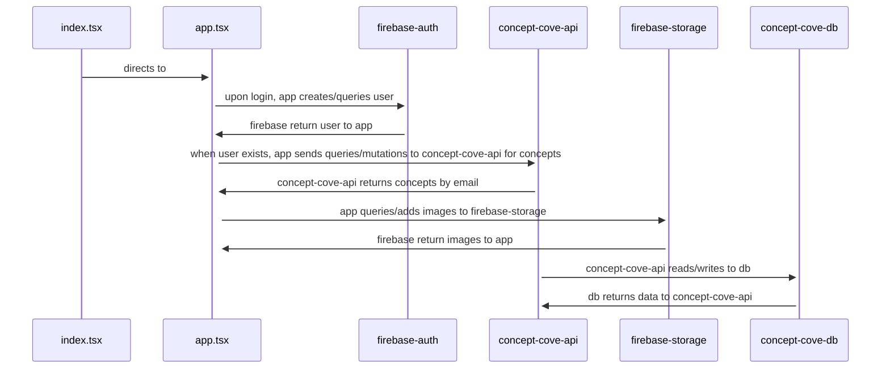
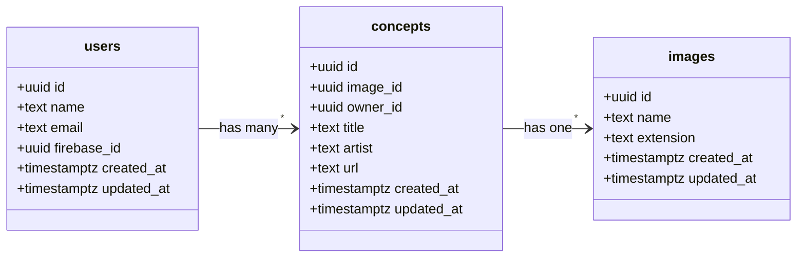

# Concept Cove

# Table of Contents
- [Inspiration](#inspiration)
- [How to use](#how-to-use)
- [Additional features](#additional-features)
- [Code Structure](#code-structure)
  - [Frontend](#frontend-typescript-react-tailwind-nextjs)
  - [Backend](#backend-typescript-nestjs)
  - [Database](#database-postgresql)

## Inspiration

Being a hobbyist 3D Artist, I will often go down a rabbit hole searching through concept art on [Artstation](https://www.artstation.com/channels/environmental_concept_design?sort_by=trending&dimension=all) to inspire my next work. I will have many tabs open, save many png's in folders and subfolders, and it would become one big mess. I decided to create a webapplication where I can store my concept art neatly and all in one place. 

## How to use

1. Log in and/or create an account with the login/signup button <br/>
2. Click the `Create +` button to input a piece of concept art into your database <br/>
3. See your posted concept art!<br/>

## Additional Features

1. You can view the images larger by clicking on them 
<br/>
2. You can edit or delete entries with the buttons on the side of each row <br/>
3. You can search over entries with the search bar <br/>


## Code structure
This is the code structure for the overall full-stack application

### Frontend (typescript, react, tailwind, Next.js)
This is a single page typescript react application, where I use tailwind for all the styling and Next.js as my framework.

#### Components
- `app.tsx` - this is where you log in/sign up, and query all the concepts
- `fullTable.tsx` - this is displays the title, create button, concepts per page dropdown, search bar, table and previous/next buttons, as well as holding the logic for sorting/filtering the rows
- `row.tsx` - this displays a single row and the edit state of the row
- `inputForm.tsd` - this is displays the input form to submit new entries

#### GraphQL
Each page uses queries and mutations from my `AppService.ts`, which is a light wrapper for the GraphQL queries/mutations in `gqlClient.ts`

For example here is my `getConceptsByEmail` function in  `AppService.ts`:
```
export const getConceptsByEmail = async (
  email: string
): Promise<getConceptByEmailData | null> => {
  const conceptsData = await gql.request<
    getConceptByEmailData,
    getConceptByEmailVariables
  >(GET_CONCEPTS_BY_EMAIL, {
    email,
  });
  return conceptsData;
};
```

And here is my `getConceptsByEmail` query in gqlClient.ts:
```
export const GET_CONCEPTS_BY_EMAIL = gql`
  query getConceptsByEmail($email: String!) {
    conceptsByEmail(email: $email) {
      id
      image_id
      title
      artist
      url
      owner_id
      createdAt
    }
  }
`;
```

#### Firebase
- firebase.ts - this file sets up my `firebaseApp` and `firebaseStorage`
- firebaseService.ts - file encapsulates all the firebase logic in my app. This is used for authentication and image storage.

### Backend (typescript, Nest.js)
My api is organized into users, concepts, and images:
 - `users` - to access the site you need to make an account, so this handles all logic around creating/querying users
 - `concepts` - each user will own multiple concepts, so this handles all the logic around creating/editing/querying concepts
 - `images` - each concept has at most one image associated with it, so this handles all the logic around creating/querying images

#### Queries/Mutations
Here are the queries and mutations:
- users
  - queries
    - findUser
  - mutations
    - createUser
- concepts
  - queries
    - conceptsByEmail
  - mutations
    - createConcept
    - updateConcept
    - deleteConcept
- images
  - queries
    - findImage
  - mutations
    - createImage

#### Firebase Auth
I make sure that the correct user is found by saving the firebase_id in the `createUser` mutation:
```
  @Mutation(() => User)
  createUser(
    @Args('createUserInput') createUserInput: CreateUserInput,
  ): Promise<User> {
    return this.usersService.create(createUserInput);
  }

  async create(createUserInput: CreateUserInput) {
    let user = new User();

    user.name = createUserInput.name;
    user.email = createUserInput.email;
    user.firebase_id = createUserInput.firebase_id;
    user = await this.usersRepository.save(user);
    return user;
  }
```
The `firebase_id`'s in my user table match the `User UID`'s in my firebase authentication container.


#### Firebase Storage
When I create an image, I both create an image entity with my `createImage` mutation, and upload the image to firebase into a folder with the `image.id` that is returned from `createImage` mutation
```
const imageData = await createImage(fileName, fileExtension);
imageId = imageData.createImage.id;
await firebaseService.uploadFile(imageId, file);
```
The `id`'s in my image table match the folder names in my firebase storage container. These lists are ordered differently, so you may not see the 1-to-1 match of id's, but they are a 1-to-t match.
 


### Database (PostgreSQL)

Here is how I store my data. 

 - `users` - each row corresponds to a user
 - `concepts` - each row corresponds to one concept that a user owns
 - `images` - each row corresponds to one image that is associated with one concept



#### Constraints

- users
  - unique email
  - unique firebase_id
- concepts
  - image_id references id on images table
  - owner_id references id on users table


 
